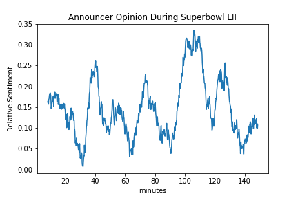

# NFL-sentiment-analysis
In this project I visualize how the announcer's opinion changes throughout an NFL game using VADER sentiment analysis

## Data
The audio is taken from a YouTube clip of the Eagles vs Patriots Superbowl LII game found [here](https://www.youtube.com/watch?v=0FF_DbJ3G68)

## Transcribing the audio
Audio is transcribed using the [SpeechRecognition](https://pypi.org/project/SpeechRecognition/) library. This allows us to pass the .wav file through Google's web speech API, or any other API in the library you may have access to. Other examples of the APIs compatible with this library are:

1. CMU Sphinx 
2. Google Cloud Speech API
3. Microsoft Bing Voice Recognition
4. Houndify API
5. IBM Speech to Text

I have decided to break the audio into 10 second windows giving us a total of about 900 data points. The audio windows can be adjusted to any length, and can be overlapped to allow SpeechRecognition to capture more context.
## Sentiment analysis
Once the audio file has been transcribed we determine the sentiment score of each window using [vaderSentiment](https://pypi.org/project/vaderSentiment/). The metric I've chosen is compound because it's aggregation of positive, negative and neutral sentiment. Check out this [Medium Article](https://medium.com/analytics-vidhya/simplifying-social-media-sentiment-analysis-using-vader-in-python-f9e6ec6fc52f) to learn more about using vaderSentiment 

